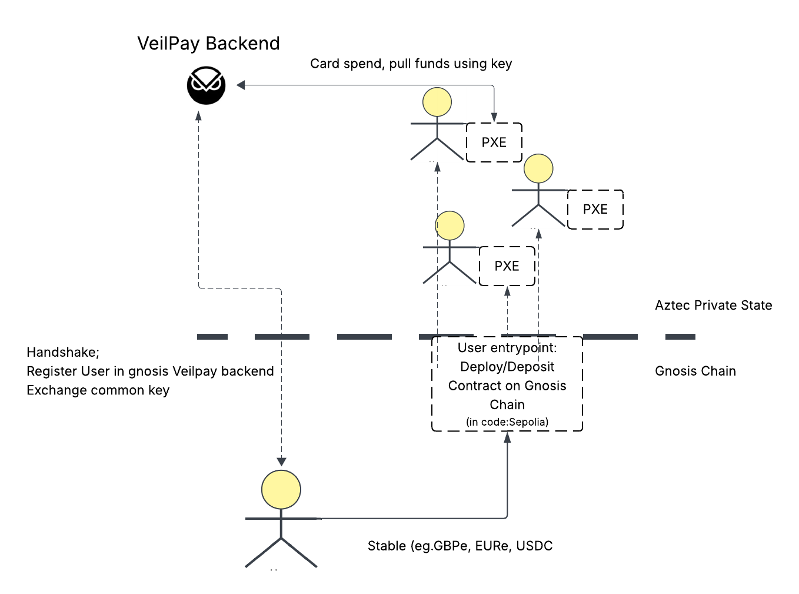

# [Gnosis VeilPay]

- **Track(s):** [Applied Encryption]
- **Team/Contributors:** Sebastian, Druv and Mohammed  
- **Repository:** https://github.com/mohammed7s/gnosis-Veilpay

## Description (TL;DR)

A private Gnosis Pay. Allowing users to spend GBPe/EURe (or any stables) in real world without revealing their 
1. funding wallets 
2. amounts of transaction 
3. historic & future spending patterns 

## Problem
Among all the noncustodial crypto cards none of them are private. They are susceptible to three privacy concerns: 
1. Privacy to Observer - All payments go through a single contract, so an observer knows (eg. the merchant you pay to or someone behind you) can look up the wallet that just spent the amount and see its future spending habits and historic. 
2. Can see funding wallet 
3. Amounts are public (they dont need to be) 

This article is a nice summary of it: https://tzedonn.substack.com/p/22-crypto-cards-will-get-you-robbed

## Solution

Hackathon solution: Aztec rollup on EVM already has tooling for privacy sets so for hack, we wrote the gnosis pay logic of the smart contract wallet in Noir smart contract and deployed on Aztec. 

Ideal solution: No need for full Aztec to be a rollup on Gnosis Chain, can construct a lean subset of the full Aztec suite and construct a lean shielded pool/privacy pools framework.

## Technology Stack

Noir Lang 
Aztec JS
Ts server for backend (gnosis pay backend)  

## Privacy Impact

This allows for noncustodial crypto cards to offer a card solution on par with historic bank cards that are confidential and allow you to transact confidentially. 

## Real-World Use Cases

All Gnosis Pay card users would benefit and UX for them is exactly the same. They top up the wallet with Monerium's GBPe or EURe on Gnosis Chain, and users start using it in same way. 

## Business Logic
This can be implemented by the Gnosis Pay team as the V2 upgrade. 

Or the code for issuing noncustodial crypto cards on Aztec product. 

## What's Next

Note: We are at a historic inflection point of cards spending being set up this way without banks in the supply chain. This paradigm of user holding stables that autoconverts behind the scenes to fiat is yet to be expanded and explored by builders and tinkerers. The first obvious extention is solving the confidentiality concerns. The next set of directions we believe is next: 

- Explore a lean privacy pools design for Gnosis VeilPay and assess tradeoffs. 
- Solve the escrow problem and make it actually noncustodial once and for all using attestations from the cards supply chain + biometrics. 

