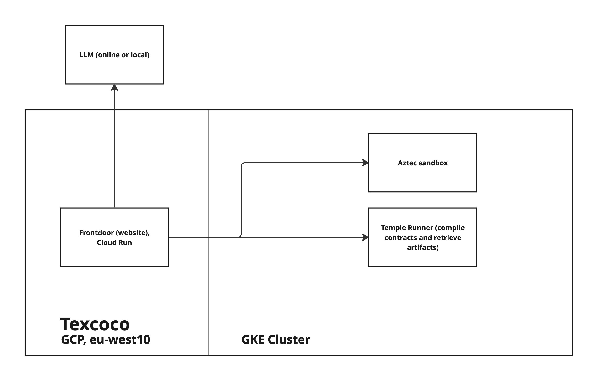

# Texcoco

- **Track(s):** Advanced Cryptography, Applied Encryption
- **Team/Contributors:** Kevin Stubbs
- **Repository:** https://github.com/kevinstubbs/Texcoco
- **Demo:**
Live site: https://frontdoor-768268294832.europe-west10.run.app
Video: https://www.loom.com/share/f42dbfd819fe406f8b07146409ade671

## Description (TL;DR)
Texcoco is an AI-native workbench for rapidly prototyping Aztec contracts and dApps. It provides a sandbox environment for developing, testing, and deploying privacy-preserving smart contracts on the Aztec network.

## Problem
Developing privacy-preserving smart contracts on Aztec requires deep knowledge of cryptography and the Noir programming language. The development process is complex, time-consuming, and error-prone, making it difficult for developers to quickly prototype and test their ideas.

## Solution
Texcoco provides:
- An AI-powered contract generation system that converts natural language descriptions into working Aztec contracts
- A sandbox environment for testing contracts with a Ethereum test fork and Aztec PXE
- Interactive UI components for contract interaction and testing
- Automatic React component generation for dApp frontends
- Integration with popular Aztec wallets like Obsidion and Azguard via @nemi-fi/wallet-sdk (EIP-1193)

## Technology Stack
- Frontdoor: Next.js for the frontend (nextjs, react, typescript, tailwind, aztec.js)
- Templerunner (compiler & artifacts generator): Aztec-ready container running a nodejs server that handles compilation requests over HTTP
- AI
    - Generating code in React and Noir for users (prompts fine-tuned for these use cases)
    - LLM calls to Anthropic
- Infrastructure/Deployments
    - Aztec sandbox and "Templerunner" run in a GKE cluster on GCP
    - Website deployed to Google Cloud Run
    - Builds done with Cloud Build

## Privacy Impact
- Enables rapid development of privacy-preserving smart contracts
- Radically reduces friction to start developing Aztec apps. With Texcoco, you could literally have ready to run React code that connects to a new contract described in natural language, faster than you could have even downloaded Aztec tools.
- Provides clear dApp integration example (solving gap of developer documentation & expired information from the Aztec Connect sunset)
- Makes the development of zero-knowledge/privacy-preserving applications accessible to anybody with a browser

## Real-World Use Cases
- Newbies can explore building Aztec contracts & applications, with AI support, without any previous knowledge or local setup.
- Individuals who want to rapidly prototype new contracts or dApp ideas.
- Developers (especially ones with transfer knowledge, but rusty or not specific Aztec/Noir knowledge) can build in Texcoco with an AI assistant specifically tuned for Aztec, Noir, and @nemi-fi/wallet-sdk. The information changes so  often, that off-the-shelf assistants (including ChatGPT, Claude and Cursor) are unable to generate valid code on their own.

## Business Logic
- Open source core platform that developers could run completely locally (including local LLM)
- Potential for premium features and support targeted for experts/professionals

## What's Next
- Support for more complex contract patterns and multi-file codebases (current iteration just uses main.nr)
- Enhanced AI contract generation capabilities
- Aztec "Snacks" where you can share a workbench state for somebody else to use as a starting place
    - Drives adoption of Aztec because suddenly people can play with and learn with no barriers (instead of "fork this, download Aztec, run aztec XYZ" it is just "play with the contract code on this link")
- AI that understands breaking changes between compiler versions (help developers keep up with rapid pace of releases)
- Expand to cover other popular ZK languages, VMs and frameworks
- Community templates and examples
