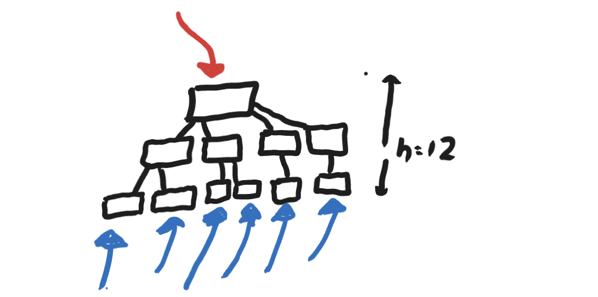
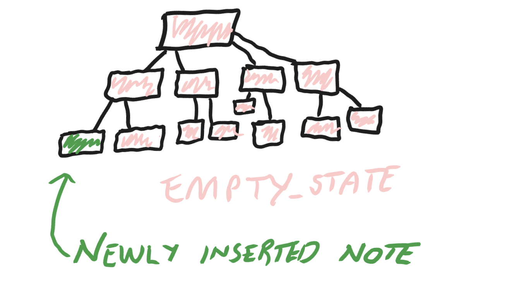
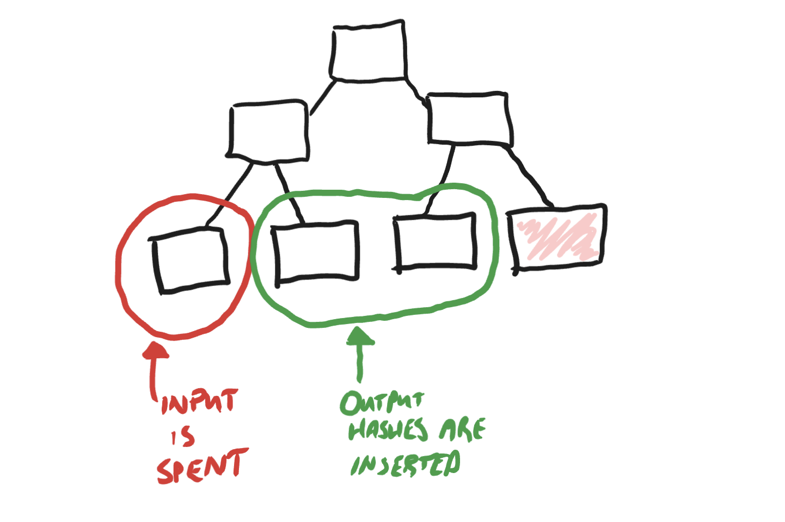
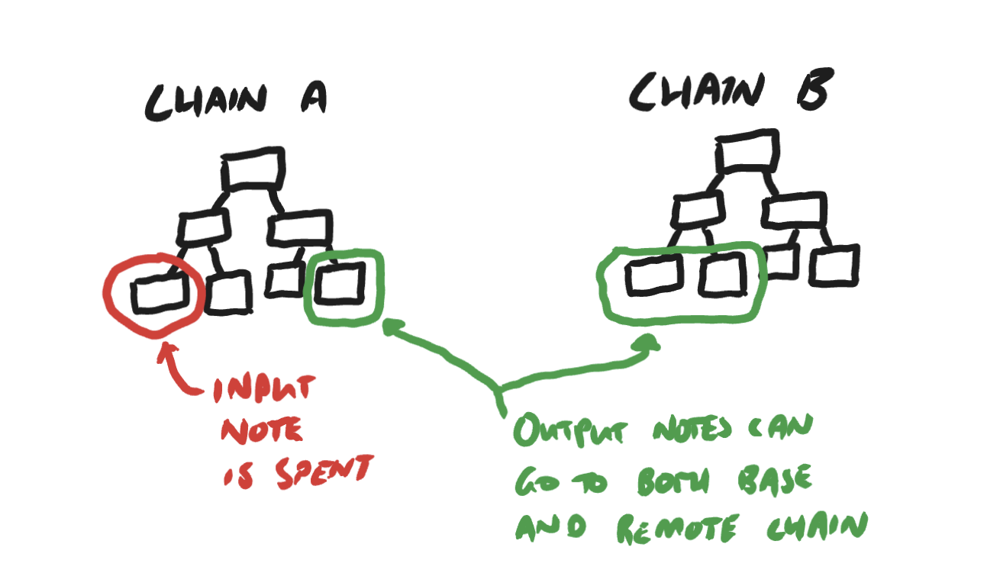
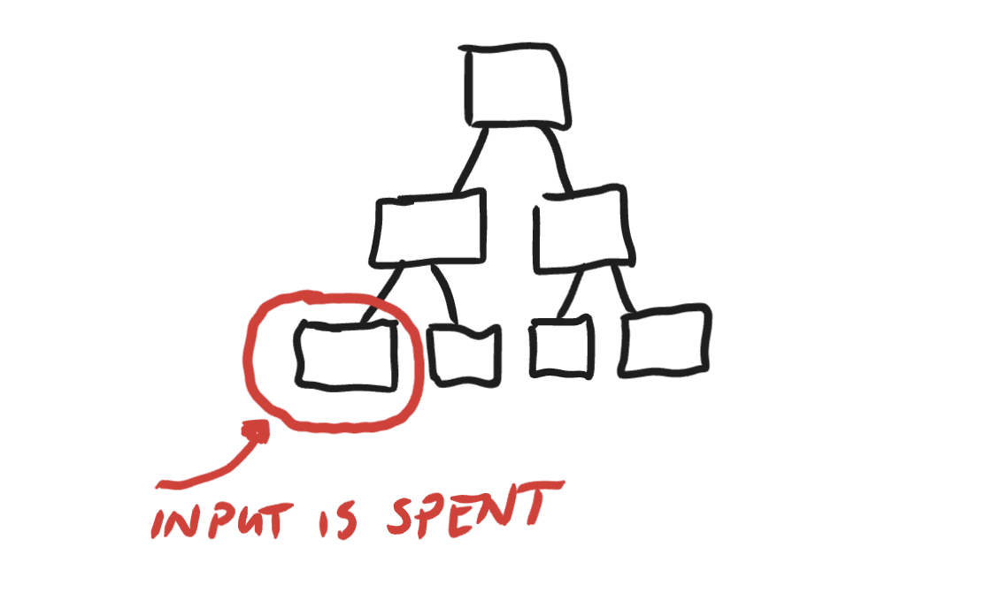

# Private Stargate Finance

- **Track(s):** Advanced Cryptography, Public Goods
- **Team/Contributors:** [Ben Hooper](https://github.com/hooperben)
- **Repository:** https://github.com/hooperben/private-stargate-finance
- **Demo:** Only CLI running for now 😢

## Description (TL;DR)

Private Stargate Finance aims to be exactly that, taking the functionality and liqudity of the https://stargate.finance and adding a layer of encryption on top to encrypt all users balances.

## Problem

There's billions of dollars locked in Stargate and other protocols like it - but they're all publicly readable. This is a bug, not a feature. Private Stargate Finance aims to convert some of this public value into private value, while still giving users the same liquidity and financial guarantees of established, cross chain protocols.

## Solution

In order to enable private transfers, we do this by using hash commitments and zero knowledge proofs to evaluate state within a merkle tree. To start, we fill the merkle tree with empty values with gives:

`initial_root = 0x124005ad54174bbcb8c2dd053ea318daa80106cdcc518731504b771d6006123f`

this initial root is made by using:

`zero_leaf = 0x1e2856f9f722631c878a92dc1d84283d04b76df3e1831492bdf7098c1e65e478`

as the leaf values for a binary merkle tree with height 12 (4,096 leaves).

### Zero Knowledge Proofs

Private Stargate Finance is consists of 4 circuits to manage this merkle tree state:

- Deposit
- Transfer
- Warp
- Withdraw

#### Deposit Circuit

When a user deposits to Private Stargate Transfer, they transfer their ERC20 to the contract, and commit to a note hash that represents this deposits details. A note hash is a poseidon hash of all note details, like:

`note_hash = poseidon(asset_id, asset_amount, owner_pub_key, note_secret);`

if a user has a valid deposit proof, their note commitment is inserted into the tree like so:

where:

- asset_id is the asset ERC20 address
- asset_amount is the asset amount (without decimal exponent)
- owner_pub_key is poseidon(owner_secret) - see account section
- note_secret is unique random value within field

#### Transfer Circuit

Transfers allow users to spent notes they have in the merkle tree. Transfer accepts:

- a root from the merkle trees recent history
- an array of input notes
- an array of output notes
- an array of nullifiers (public)
- an array of output hashes (public)

The golden rule of transfers is that the sum of all assets in the input notes MUST equal to the sum of all assets in the output notes, or the proof is not valid.

Our Transfer ZKP verifies:

- the sum of inputs == sum of outputs
- the user knows the secret that hashes to each input notes owner_pub_key
- the user knows some merkle path that matches the merkle root given, which matches the contracts history of merkle roots
- the input notes calculated nullifer = the nullifier provided for it
- the output note hashes match the output note that creates it

If a users transfer ZKP is valid, their input notes are nullified (spent), and the tree transitions to a new root.

#### Warp Circuit

A warp is a cross chain transfer. The Warp ZKP circuit is very similar to the transfer circuit, except it has public flags for:

- stargate asset to send to remote chain WSP contract
- startgate asset amount to send chian WSP contract

Currently, this requires 2 LZ messages to work which is not ideal.

- The first message is the Stargate OFT transfer message.
- The second message is the output hashes to insert in the remote chains tree.

Once the output hashes arrive on the destination chain, these notes are spendable in transfers, warps or withdrawals.

#### Withdrawal Circuit

A withdraw allows a user to withdraw any input notes they wish to, back to the ERC20 this note represents. The withdraw circuit is very similar transfer, except:

- it does not insert any outpush_hashes
- it accepts an array of addresses to send the erc20 output too (to avoid this tx being front runnable)

## Technology Stack

I used:

- noir to write the zero knowledge circuits
- solidity to write the smart contracts
- hardhat (typescript) to do the contract testing (+ zk proofs)
- layerzero (and stargate) to handle the cross chain aspects of the application.

## Privacy Impact

If this worked better - I think that this would be an awesome tool for all to use. A system like this could faciliate cross chain transfers without anyone knowing who is moving what, just like traditional finance.

## Real-World Use Cases

If this product were to have:

- proving times get to sub 1 second
- execution on an L2 (or perhaps a chain with zk friendly hash precompiles) to be sub ~5 million
- sub 0.01 tx cost

I think this would be a super useful protocol. That being said, there's a lot of issues to (and finish), including:

- account model
- note sharing model
- relayer (for enabling more privacy)

## Business Logic

I don't really know how to make money off this project without potential being jailed. This is very much a protocol, building a business on top of it is not something I've really thought about all that much, I'm just trying to get better at building things like this as I think they will eat a lot of businesses soon.

## What's Next

Get it running on mainnet, and integrated into https://commbank.eth.limo. I have started on the regular (non-encrypted) stargate finance integration there:

